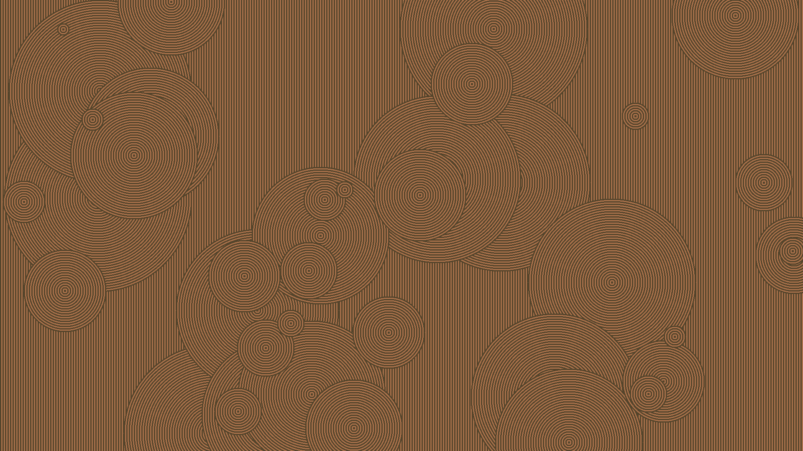
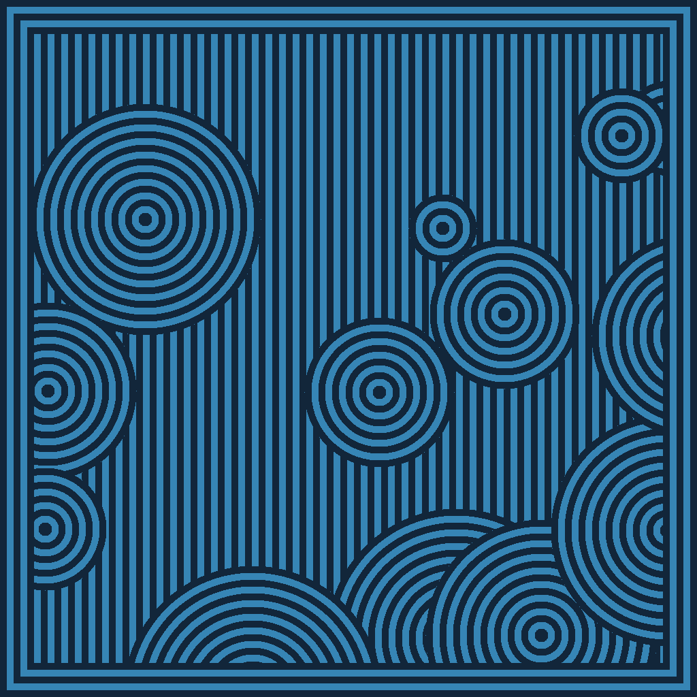
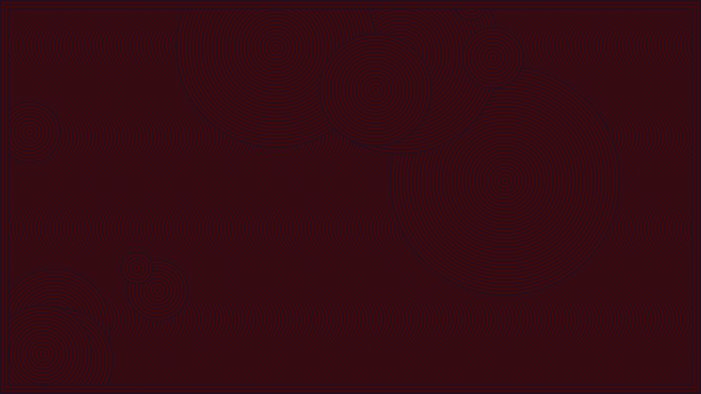

# Jomon

Jomon pottery-/Sheikah-inspired pattern image generator

## Usage

Jomon creates a [ppm image](https://en.wikipedia.org/wiki/Netpbm) with a combination of default options and user supplied ones. Available options are:

- `-y`: Height, in pixels
- `-x`: Width, in pixels
- `-d`: Minimum density (count) of circles
- `-D`: Maximum density (count) of circles
- `-r`: Minimum radius (size) of circles
- `-R`: Maximum radius (size) of circles
- `-s`: Seed (default is the current time)
- `-S`: Stroke width (line width)
- `-c`: The darker "background" color
- `-C`: The lighter "foreground" color
- `-o`: What to name the output file (default is `jomon-${current time}.ppm`)
- `-O`: Output bytes to stdout instead of file
- `-v`: Verbose; gives information about random generation
- `-h`: Prints a help message and exits
- `-b`: Number of rounds (stripes) of the border, 0 disables it
- `-W`: Wave height, how tall a cycle of the wave is in the columns
- `-w`: Wave width, how wide a wave is/how far it travels horizontally in the columns

The current defaults are defined as macros in the code. I plan to add them to the Makefile for another way to configure them.

## Todos

- [x] Allow command line arguments to be passed, with defaults for not passing them
  - [x] Height and width
  - [x] Dark and Light colors
  - [x] Output file name
    - [x] (Maybe) also allow outputting to stdout
  - [x] Stroke width
  - [x] Density minimum and maximum (range of how many circles to include)  
  - [x] Random seed for srand and rand functions
- [x] Implement random generator of circles (position and radius/diameter)
- [x] Implement shader-like function for determining the pixels
  - [x] Determine a given pixel's distance to the center of a circle and if the pixel is within that circle,
    - [x] If within the circle, use distance to determine pixel color
    - [x] If not within the circle, use x value to determine column and color based on column
- [ ] Makefile compiler flags
  - [ ] Default macro definitions in Makefile as variables for easy redefinition when compiling
- [x] Documentation
  - [x] In-code docs
  - [x] CLI args docs
  - [x] (Better) README docs
- [x] Add slight perpendicular movement to columns
- [ ] (Maybe) Add random low chance for pixels to be the opposite color
- [x] Swap to `-x` and `-y` for width and height respectively so `-h` can be help information
- [ ] (Maybe) Refine render function to allow dark and light sections to have different stroke widths
- [x] Add option to draw a border around image
- [ ] (Maybe) Refactor arguments parsing to take longer names as well (`getopt_long`)
- [ ] Move verbose logs to the functions that handle the information printed
- [ ] Refactor to split out the different parts of the pixelFunction into separate functions

## What the program *should* be structured like

- Parse CLI flags and use defaults for missing flags
- Call srand with CLI seed or current time as default
- Generate random number of circles with random positions and size (number of bands)
- Sort circles by size
- Set up buffer for storing pixels
- Run pixel function for each pixel
- Generate final PPM file data from buffer and some metadata
- Put PPM file data into where it belongs
- Print to stdout the filename (unless output is put to stdout)
